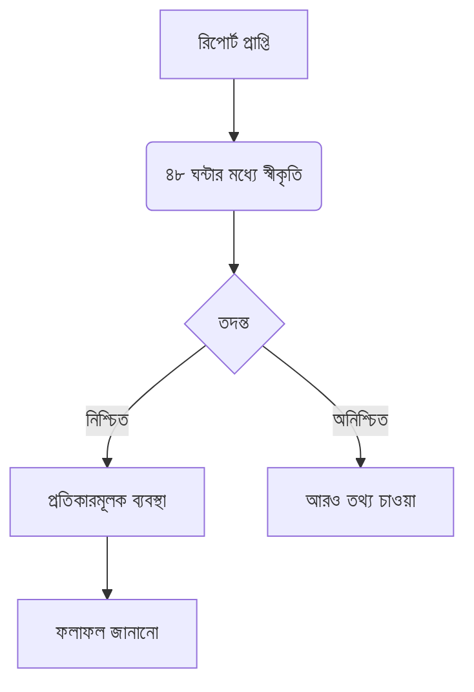

```markdown
<div align="center">
  
  <h1>🥭 MangoEditor সম্প্রদায় আচরণবিধি</h1>
  <p>একটি নিরাপদ, সম্মানজনক ও উৎপাদনশীল পরিবেশ নিশ্চিতকরণ</p>
</div>

## 🌟 আমাদের প্রতিশ্রুতি

MangoEditor টিম প্রতিশ্রুতিবদ্ধ:
- সকল লিঙ্গ, লিঙ্গ-পরিচয়, যৌন অভিমুখিতা, অক্ষমতা, জাতি, ধর্ম, বয়স ও অভিজ্ঞতার মানুষদের জন্য সম্মানজনক পরিবেশ তৈরি করতে
- বাংলাদেশী প্রযুক্তি সম্প্রদায়ের সাংস্কৃতিক মূল্যবোধ রক্ষা করতে
- মুক্ত ও উন্মুক্ত আলোচনা উৎসাহিত করতে

## ✅ গ্রহণযোগ্য আচরণের উদাহরণ

| ক্ষেত্র                | আদর্শ আচরণ                          |
|------------------------|--------------------------------------|
| যোগাযোগ               | "আপনার কোডে একটি ছোট সমস্যা দেখা যাচ্ছে" |
| সমালোচনা              | "এই পদ্ধতিটি আরও উন্নত হতে পারে..."     |
| মতবিরোধ               | "আমাদের দৃষ্টিভঙ্গি ভিন্ন, এভাবে চেষ্টা করলে কী মনে করেন?" |
| নতুন সদস্য            | "স্বাগতম! কিভাবে সাহায্য করতে পারি?"    |

## ❌ অগ্রহণযোগ্য আচরণ

### ভাষাগত আচরণ
- "এত সহজ জিনিস বুঝতে পারছ না?" (অবমাননাকর)
- "তুমি তো একদম ফ্রেশার" (অপমানজনক)

### প্রযুক্তিগত আচরণ
- ইচ্ছাকৃতভাবে ভুল তথ্য দেওয়া
- অন্যের কোডে ক্ষতিকর পরিবর্তন করা

### সাংস্কৃতিক সংবেদনশীলতা
- ধর্মীয় বা রাজনৈতিক আলোচনা
- লিঙ্গভিত্তিক রসিকতা

## 🛡️ রিপোর্টিং প্রক্রিয়া

### জরুরি যোগাযোগ (২৪/৭)
```bash
ইমেইল: emergency@mangoeditor.org
ফোন: +880 XXX-XXXXXX (শুধু জরুরি ক্ষেত্রে)
```

### অনলাইন রিপোর্ট
[](https://github.com/mangoeditor/mangoeditor/issues/new?template=COC_REPORT.md)

**রিপোর্টে যা থাকবে:**
1. ঘটনার তারিখ ও সময়
2. সংশ্লিষ্ট ব্যক্তি/ব্যক্তিবর্গ
3. ঘটনার বিস্তারিত বিবরণ
4. সাক্ষী (যদি থাকে)

## ⚖️ প্রয়োগ প্রক্রিয়া



**প্রতিকারমূলক ব্যবস্থার ধাপ:**
1. সতর্কতা (প্রথমবার)
2. অস্থায়ী নিষেধাজ্ঞা (পুনরাবৃত্তি)
3. স্থায়ী নিষেধাজ্ঞা (গুরুতর ক্ষেত্রে)

## 🇧🇩 বাংলাদেশী প্রেক্ষাপট

### বিশেষ নির্দেশনা:
- বাংলা ও ইংরেজি উভয় ভাষায় সম্মান বজায় রাখুন
- সরকারী ডিজিটাল নিরাপত্তা আইন, ২০২৩ মেনে চলুন
- ধর্মীয় ও রাজনৈতিক আলোচনা এড়িয়ে চলুন

### স্থানীয় রিসোর্স:
- [বাংলাদেশ সাইবার ক্রাইম টিম](https://www.cybercrime.gov.bd/)
- [বিডিওএসএন গাইডলাইন](https://bdosn.org/coc)

## 🙏 স্বীকৃতি

এই নথি তৈরি করতে সহায়তা করেছেন:
- বাংলাদেশ ওপেন সোর্স নেটওয়ার্ক
- ঢাকা বিশ্ববিদ্যালয়ের সফটওয়্যার ইঞ্জিনিয়ারিং বিভাগ
- মাইক্রোসফ্ট বাংলাদেশ ডেভেলপার কমিউনিটি

---

<div align="center">
  <p><strong>সর্বশেষ হালনাগাদ:</strong> জানুয়ারি ২০২৪</p>
  <p><strong>প্রয়োগকারী:</strong> MangoEditor নৈতিকতা বোর্ড</p>
</div>
```
