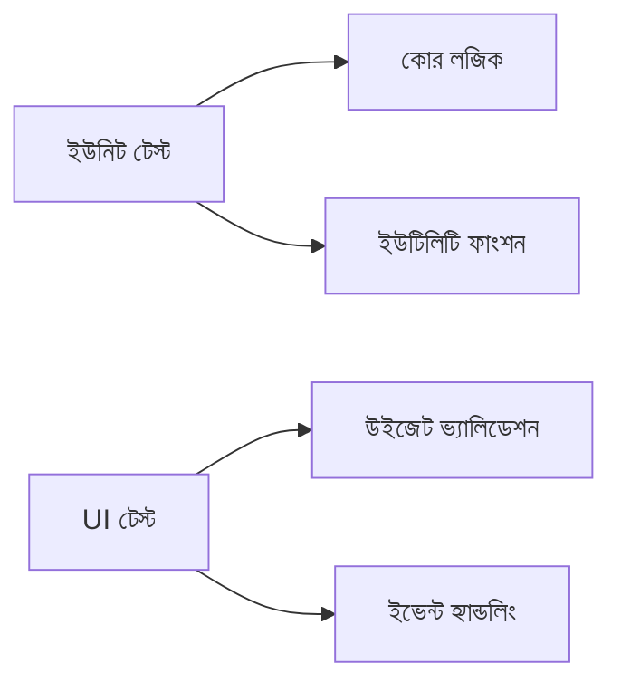

```markdown
<div align="center">
  
  <h1>🥭 MangoEditor-এ অবদান রাখার নির্দেশিকা</h1>
</div>

## 🌱 প্রথমবারের মতো অবদানকারীদের জন্য

### ১. রিপোজিটরি ফর্ক করুন
[](https://github.com/mangoeditor/mangoeditor/fork)

### ২. লোকালে ক্লোন করুন
```bash
git clone https://github.com/your-username/mangoeditor.git
cd mangoeditor
git remote add upstream https://github.com/mangoeditor/mangoeditor.git
```

### ৩. ডেভেলপমেন্ট এনভায়রনমেন্ট সেটআপ করুন
```bash
# Ubuntu/Debian
sudo apt install -y build-essential qt5-default cmake

# Windows
choco install cmake qt5
```

## 📝 কোডিং স্ট্যান্ডার্ড

### বাংলা কমেন্ট স্টাইল
```cpp
/**
 * @brief বাংলা ফাংশনের বিস্তারিত বর্ণনা
 * @param নাম প্যারামিটারের উদ্দেশ্য
 * @return ফাংশন থেকে কী ফেরত আসে
 * 
 * @example
 * বাংলা_ফাংশন("ম্যাঙ্গো");
 */
void বাংলা_ফাংশন(string নাম) {
    // এক লাইনের মন্তব্য
}
```

### কমিট মেসেজ টেমপ্লেট
```text
[প্রকার]: সংক্ষিপ্ত বর্ণনা (৫০ অক্ষরের মধ্যে)

বিস্তারিত বিবরণ (৭২ অক্ষরের পরে র্যাপ করুন)

- পরিবর্তনের বুলেট পয়েন্ট
- প্রতিটি বুলেট সম্পূর্ণ বাক্য

Closes #ইস্যু_নম্বর
```

**প্রকারের তালিকা**:
- `feat`: নতুন ফিচার
- `fix`: বাগ ফিক্স
- `docs`: ডকুমেন্টেশন পরিবর্তন
- `style`: ফরম্যাটিং পরিবর্তন
- `refactor`: কোড রিফ্যাক্টর

## 🧪 টেস্টিং গাইড

### টেস্ট স্যুট


### টেস্ট রান করুন
```bash
# সমস্ত টেস্ট
ctest -V --output-on-failure

# নির্দিষ্ট মডিউল
./tests/editor_core_tests
```

## 🔄 পুল রিকোয়েস্ট প্রক্রিয়া

1. আপনার ব্রাঞ্চ আপডেট করুন:
   ```bash
   git fetch upstream
   git rebase upstream/main
   ```

2. কোড ফরম্যাট করুন:
   ```bash
   ./scripts/format-code.sh
   ```

3. GitHub-এ PR খুলুন এবং টেমপ্লেট পূরণ করুন

**PR টেমপ্লেট**:
```markdown
## পরিবর্তনের বিবরণ
[বিস্তারিতভাবে বর্ণনা করুন]

## স্ক্রিনশট (যদি প্রযোজ্য)


## সম্পর্কিত ইস্যু
Closes #issue-number

## টেস্ট রেজাল্ট
```bash
[টেস্ট আউটপুট এখানে পেস্ট করুন]
```
```

## 🛠️ সমস্যা সমাধান

### সাধারণ ইস্যু
| সমস্যা | সমাধান |
|--------|--------|
| CMake এরর | `rm -rf build && mkdir build` |
| Qt নট ফাউন্ড | `export PATH=/opt/Qt/5.15.2/bin:$PATH` |
| বাংলা ফন্ট রেন্ডারিং | `sudo apt install fonts-beng-extra` |

## 🤝 যোগাযোগ

<div align="center">

| মাধ্যম | লিংক | ঘন্টা (BST) |
|--------|------|------------|
| 💬 Discord | [জয়েন করুন](https://discord.gg/mangoeditor) | ২৪/৭ |
| 📧 ইমেইল | contributors@mangoeditor.org | ৯টা-৫টা |
| 🐦 Twitter | [@MangoEditor](https://twitter.com/MangoEditor) | ১০টা-৮টা |

</div>

## 🇧🇩 বাংলাদেশী অবদানকারীদের জন্য

### বিশেষ রিসোর্স
- [বাংলায় কোডিং গাইড](docs/bn_CODING_GUIDE.md)
- [স্থানীয় মিটআপ](https://mangoeditor.org/meetups/bd)
- [বাংলাদেশী টিউটোরিয়াল](https://youtube.com/mangoeditor-bd)

### ব্যাংক ট্রান্সফার (স্পন্সরশিপ)
```
ব্যাংক: ডাচ-বাংলা ব্যাংক
অ্যাকাউন্ট: MangoSoft Bangladesh
একাউন্ট নং: 123.456.789
ব্রাঞ্চ: মিরপুর, ঢাকা
```

---

<div align="center">
  <p><strong>সর্বশেষ হালনাগাদ:</strong> জানুয়ারি ২০২৪</p>
  <p><strong>লাইসেন্স:</strong> [MIT](LICENSE)</p>
</div>
```

