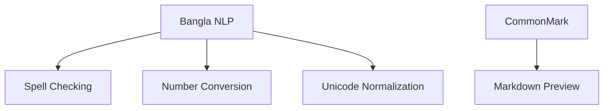

```markdown
# 📦 MangoEditor Dependency Documentation

<div align="center">
  
</div>

## 🏗️ Core Dependencies

### Build Requirements
| Dependency       | Min Version | Purpose                     | Verification Command         |
|------------------|-------------|-----------------------------|-------------------------------|
| CMake           | 3.15        | Build system                | `cmake --version`            |
| Qt Framework    | 5.15        | GUI Framework               | `qmake --version`            |
| C++ Compiler    | C++17       | GCC/Clang/MSVC              | `g++ --version`              |

### Runtime Dependencies
```bash
# Ubuntu/Debian
sudo apt install -y \
  libgl1-mesa-dev \
  libxcb-xinerama0 \
  qt5-default \
  libqt5svg5-dev
```

## 🔌 Third-Party Libraries

### Editor Components
| Library         | Version | License     | Integration Guide              |
|-----------------|---------|-------------|---------------------------------|
| Scintilla       | 4.4+    | MIT         | [Docs](thirdparty/scintilla/)  |
| QScintilla      | 2.13+   | GPL v3      | [Setup Guide](docs/qscintilla.md) |

### Language Support


## 🌐 Platform-Specific Requirements

### Windows
```powershell
# Install Visual C++ Redist
winget install Microsoft.VCRedist.2015+.x64
```

### macOS
```bash
# Required development tools
xcode-select --install
brew install qt@5
```

### Linux (Bangladesh Dev Setup)
```bash
# Install Bengali fonts
sudo apt install fonts-kalpurush fonts-lohit-bengali
```

## 🛠️ Development Tools

### Recommended Environment
- **IDE**: Qt Creator 8.0+
- **Debugger**: GDB 10+ or LLDB 12+
- **Formatter**: clang-format-12
- **Docs**: Doxygen 1.9+

```bash
# Setup dev environment (Ubuntu)
sudo apt install -y \
  qtcreator \
  clang-format-12 \
  doxygen \
  graphviz
```

## 🔍 Troubleshooting Guide

### Common Issues
1. **Missing Qt Components**:
   ```bash
   # Reinstall Qt with all modules
   sudo apt install --reinstall qt5-default
   ```

2. **Linker Errors**:
   ```bash
   # Refresh library cache
   sudo ldconfig
   ```

3. **Bangla Font Rendering**:
   ```bash
   # Install additional fonts
   sudo apt install fonts-beng fonts-beng-extra
   ```

## 📊 Dependency Graph
```bash
# Generate dependency graph
cmake --graphviz=deps.dot && dot -Tpng deps.dot -o deps.png
```

---

<div align="center">
  <p><strong>Last Updated:</strong> January 2024</p>
  <p><strong>Next Review:</strong> July 2024</p>
  <p><strong>Maintainer:</strong> MangoSoft Dependencies Team</p>
</div>
```

