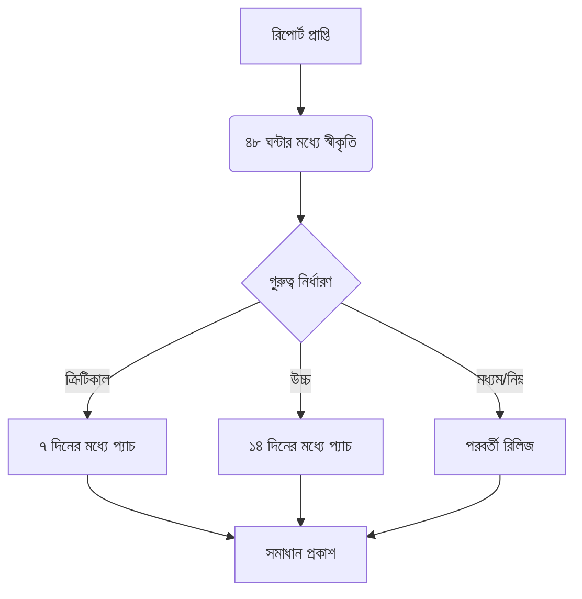

```markdown
<div align="center">
  
  <h1 style="color: #e63946; border-bottom: 2px solid #e63946; padding-bottom: 10px; display: inline-block;">MangoEditor নিরাপত্তা নীতি</h1>
</div>

## 🛡️ সংস্করণ সমর্থন

<div style="background: #f8f9fa; border-radius: 10px; padding: 20px; margin: 20px 0;">

| সংস্করণ   | অবস্থা         | নিরাপত্তা আপডেটের মেয়াদ | সমর্থন স্তর |
|-----------|---------------|--------------------------|-------------|
| 2.0.x     | ✅ সক্রিয়     | ডিসেম্বর ২০২৫           | সম্পূর্ণ    |
| 1.2.x     | ⚠️ রক্ষণাবেক্ষণ | জুন ২০২৪                | সীমিত       |
| 1.1.x     | ❌ সমর্থনহীন  | -                        | নেই         |

</div>

## 🚨 নিরাপত্তা সমস্যা রিপোর্টিং

<div style="background: #fff3f3; border-left: 4px solid #e63946; padding: 15px; margin: 20px 0;">

**গুরুত্বপূর্ণ:** নিরাপত্তা সমস্যা কখনই পাবলিক ইস্যু ট্র্যাকারে রিপোর্ট করবেন না।

</div>

### 📩 রিপোর্ট করার পদ্ধতি

<div style="display: grid; grid-template-columns: repeat(auto-fit, minmax(250px, 1fr)); gap: 15px; margin: 20px 0;">

<div style="background: #f0f7ff; border-radius: 8px; padding: 15px;">
<h4>ইমেইল মাধ্যমে</h4>
<p>security@mangoeditor.org</p>
<a href="https://mangoeditor.org/security/pgp.asc" style="background: #4a6fa5; color: white; padding: 5px 10px; border-radius: 5px; text-decoration: none;">PGP কী ডাউনলোড</a>
</div>

<div style="background: #f0f7ff; border-radius: 8px; padding: 15px;">
<h4>GitHub মাধ্যমে</h4>
<p>প্রাইভেট ভালনারেবিলিটি রিপোর্টিং</p>
<a href="https://github.com/mangoeditor/mangoeditor/security/advisories" style="background: #24292e; color: white; padding: 5px 10px; border-radius: 5px; text-decoration: none;">রিপোর্ট জমা দিন</a>
</div>

</div>

### 📋 রিপোর্টে যা অন্তর্ভুক্ত করতে হবে

1. 🔍 সমস্যার বিস্তারিত বিবরণ
2. 🛠️ সমস্যা পুনরায় তৈরি করার ধাপসমূহ
3. 💥 সম্ভাব্য প্রভাব বিশ্লেষণ
4. </> প্রমাণ হিসেবে কোড স্নিপেট
5. 📞 আপনার যোগাযোগের তথ্য

## ⚙️ সমস্যা সমাধান প্রক্রিয়া

<div style="background: #f8f9fa; border-radius: 10px; padding: 20px; margin: 20px 0;">



</div>

## 🔒 নিরাপত্তা ব্যবস্থাপনা

<div style="display: grid; grid-template-columns: repeat(auto-fit, minmax(300px, 1fr)); gap: 20px; margin: 20px 0;">

<div style="background: #f0f8ff; border-radius: 8px; padding: 15px;">
<h4>🛡️ কোড বিশ্লেষণ</h4>
<ul>
<li>সাপ্তাহিক SAST/DAST স্ক্যান</li>
<li>প্রতিটি PR-এ নিরাপত্তা পর্যালোচনা</li>
</ul>
</div>

<div style="background: #f0f8ff; border-radius: 8px; padding: 15px;">
<h4>📦 নির্ভরতা ব্যবস্থাপনা</h4>
<ul>
<li>Dependabot স্বয়ংক্রিয় আপডেট</li>
<li>সাপ্তাহিক দুর্বলতা স্ক্যান</li>
</ul>
</div>

<div style="background: #f0f8ff; border-radius: 8px; padding: 15px;">
<h4>🧪 পরীক্ষণ পদ্ধতি</h4>
<ul>
<li>ফাজ টেস্টিং</li>
<li>অনুপ্রবেশ পরীক্ষণ</li>
</ul>
</div>

</div>

## ⚙️ নিরাপদ কনফিগারেশন

```ini
[নিরাপত্তা]
প্লাগইন_স্যান্ডবক্স = true
দূরবর্তী_কোড_নিষ্ক্রিয় = true
নিরাপত্তা_নীতি = "কঠোর"
অনিরাপদ_বৈশিষ্ট্য = false
```

## 🏆 নিরাপত্তা গবেষকদের স্বীকৃতি

<div style="background: #fffaf0; border-radius: 10px; padding: 20px; margin: 20px 0;">

| বছর   | গবেষক          | CVE আইডি       | সমস্যার ধরন               |
|-------|----------------|----------------|---------------------------|
| ২০২৩ | রহিম আহমেদ     | CVE-2023-XXXX  | মেমরি ব্যবস্থাপনা সমস্যা |
| ২০২২ | সুমাইয়া ইসলাম  | CVE-2022-XXXX  | তথ্য প্রকাশের দুর্বলতা    |

</div>

## ℹ️ সহায়ক সম্পদ

<div style="display: flex; flex-wrap: wrap; gap: 10px; margin: 20px 0;">

[](https://mangoeditor.org/security/faq)
[](https://mangoeditor.org/security/pgp.asc)
[](https://mangoeditor.org/blog/security)

</div>

---

<div align="center" style="margin-top: 30px;">
  <p><strong>সর্বশেষ হালনাগাদ:</strong> জুলাই ২০২৩</p>
  <p><strong>পরবর্তী পর্যালোচনা:</strong> জানুয়ারি ২০২৪</p>
</div>
```

